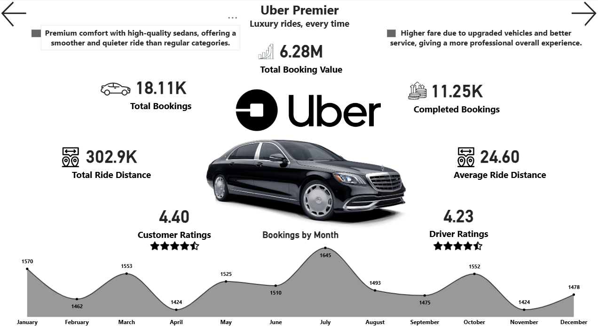

# Uber Multi-Tier Mobility Analysis

---

## 📌 Project Overview

This project delivers an end-to-end analysis of Uber’s multi-tier ride ecosystem using the Uber NCR bookings dataset.  
The focus areas include:

- Booking trends  
- Revenue performance  
- Cancellations  
- Vehicle-level behavior  
- Payment method adoption  

Data cleaning and feature engineering were performed in **Python (Pandas)**, and dashboards were built using **Power BI**.

---

## 🧹 Data Cleaning & Transformation (Jupyter Notebook)

### ✔ 1. Loaded & Inspected Dataset  
### ✔ 2. Converted columns to proper DateTime  
### ✔ 3. Removed 2 null-heavy columns (>80% missing)  
### ✔ 4. Feature Engineering
- Time Bucket  
- Day/Night  
- Weekday  
- Estimated Revenue  
- Payment Type (Digital / Cash)  
- Month-Year 

### ✔ 5. Exported cleaned CSV  
Used as the input file for Power BI.

---

## 📊 Dashboard Pages

### **1️⃣ Overview Dashboard**
- Total bookings  
- Total revenue  
- Average revenue  
- Total ride distance  
- Payment method distribution  
- Booking status breakdown  
- Monthly booking trend  

---

### **2️⃣ Revenue Analysis**
- Revenue by vehicle type  
- Revenue by weekday  
- Revenue by payment method  
- Estimated lost revenue  
- Completed vs incomplete revenue  
- Monthly revenue trend  

---

### **3️⃣ Booking Trends**
- Booking by weekday  
- Booking by day/night  
- Booking by time bucket  
- Vehicle type distribution  
- Most frequent pickup & drop points  

---

### **4️⃣ Cancellation Analysis
- Cancellations by customer  
- Cancellations by driver  
- Reason distribution  
- Month + Vehicle filters  
- Estimated revenue loss due to cancellations  

---

### **5️⃣ Uber Premier Spotlight**
- KPIs: Bookings, Revenue, Ride Distance  
- Customer & driver ratings  
- Luxury vehicle highlight  
- Monthly performance trend  

---

## 🧠 Key Insights

- Auto & Bike dominate booking volume  
- Premier yields highest revenue per ride  
- UPI leads digital payments significantly  
- Cancellations cause major revenue loss  
- Demand peaks in the evening slot (6 PM–12 AM)  
- Premier has strongest satisfaction metrics  

---

## 🛠 Tech Stack

| Component | Technology |
|----------|------------|
| Data Cleaning | Python (Pandas, NumPy) |
| Feature Engineering | Python |
| Visualization | Power BI |
| Dataset | Kaggle NCR Uber Bookings |
| Version Control | Git, GitHub |

---

## ▶️ How to Use

### **View Dashboard**
Download `.pbix` → Open in Power BI Desktop.

### **Re-run Preprocessing**
Open notebook → Run all cells → Generate cleaned CSV.

